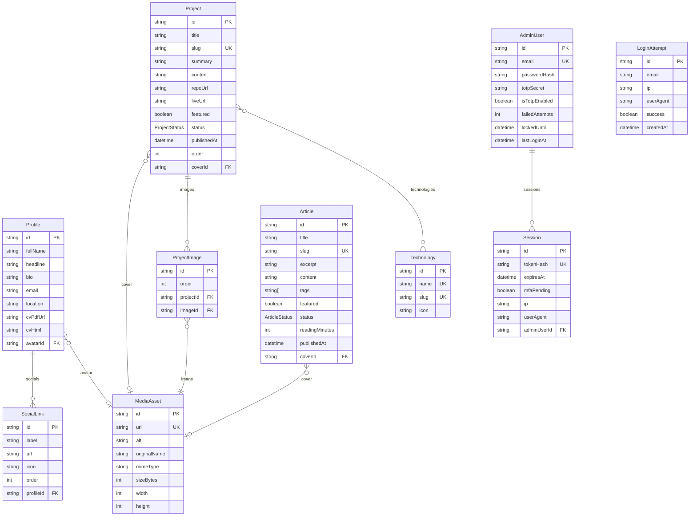

# ERD — Modèle de données

Source de vérité : `packages/db/prisma/schema.prisma` (le diagramme ci-dessous illustre le cœur).

> Modèles ajoutés depuis (cf. schéma) — à intégrer au diagramme lors d'une prochaine régénération :
> **Agenda/média** : `Event`, `EventMedia`, `ArticleMedia`, `AppointmentRequest` (+ `MediaKind`
> VIDEO/EMBED sur `MediaAsset`, `Article.scheduledAt`/`status SCHEDULED`).
> **i18n** : `Translation` (overlay EN par champ). **IA** : `AiAssistantConfig`.

## Entités

### Authentification (back office)
- **AdminUser** — compte admin unique : `passwordHash` (argon2id), `totpSecret` (base32, null tant
  que non enrôlé), compteurs anti brute-force (`failedAttempts`, `lockedUntil`).
- **Session** — session opaque serveur : seul le `tokenHash` (SHA-256) est stocké, `mfaPending`
  distingue mot de passe validé / 2e facteur en attente. Cascade sur suppression de l'`AdminUser`.
- **LoginAttempt** — journal des tentatives (monitoring anti brute-force) ; `email` = valeur saisie,
  peut ne correspondre à aucun compte.

### Contenu

- **Profile** (singleton) — identité du site : nom, accroche, bio, email, lien PDF du CV et
  **CV complet en HTML** (mise en page premium, éditable au back office). Avatar → `MediaAsset`.
- **SocialLink** — liens sociaux du profil (label, url, icône, ordre).
- **Project** — projet du portfolio : `slug` unique, statut `DRAFT`/`PUBLISHED`, cover → `MediaAsset`,
  technologies (m2m), galerie (`ProjectImage`).
- **ProjectImage** — image de galerie d'un projet → `MediaAsset`.
- **Technology** — technologie réutilisable (m2m avec `Project`).
- **Article** — news/article : `slug` unique, `tags` (liste), statut `DRAFT`/`PUBLISHED`, cover → `MediaAsset`.
- **MediaAsset** — chaque image webp convertie (url, type, taille, dimensions) ; référencée par
  avatar de profil, cover de projet/article et galerie.

## Enums
- `ProjectStatus` : `DRAFT`, `PUBLISHED`
- `ArticleStatus` : `DRAFT`, `PUBLISHED`
